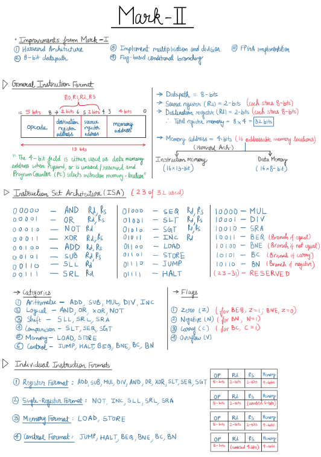
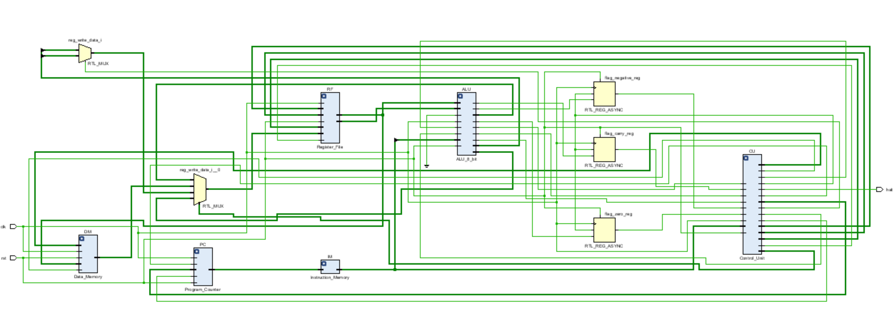
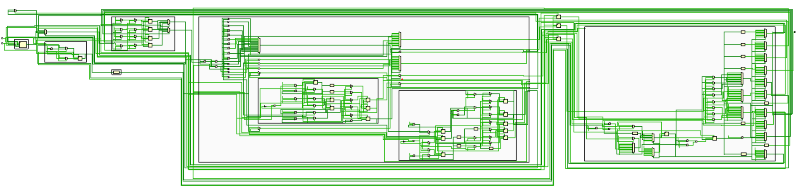
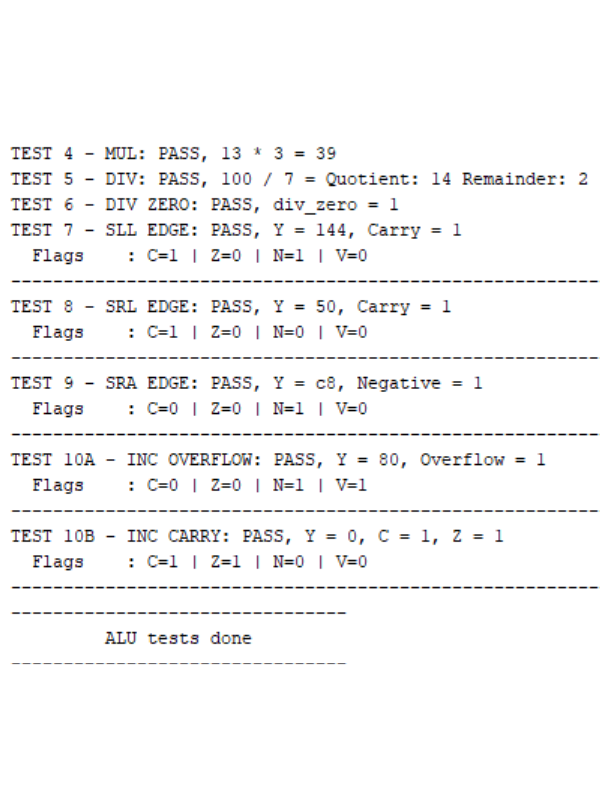
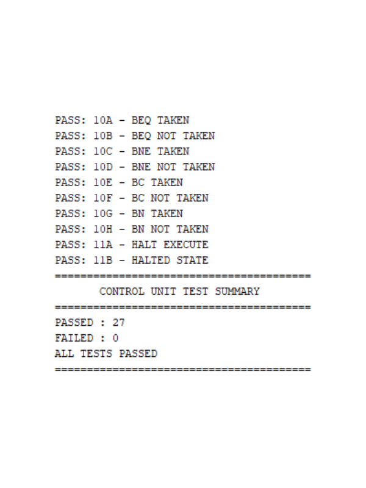
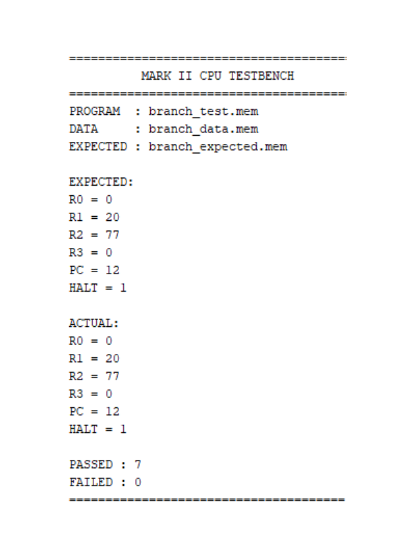
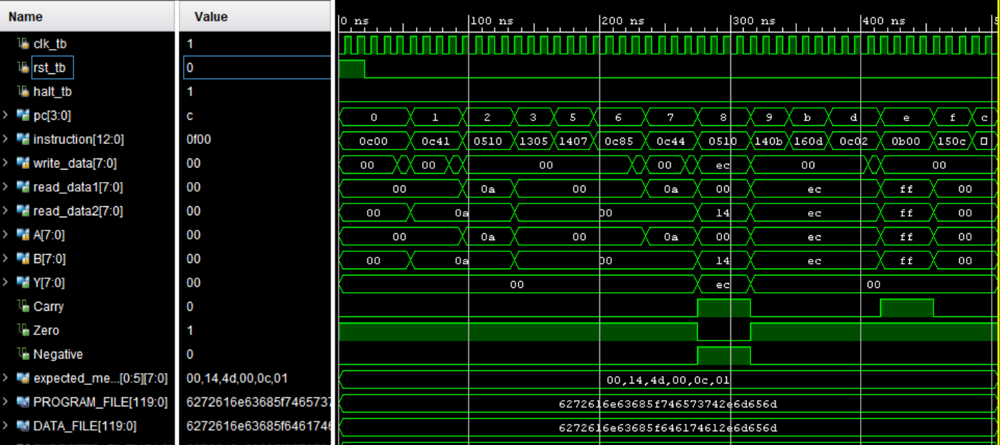

# Mark_II_8_bit_CPU


## 1. Overview

Mark II is an 8-bit multi-cycle CPU designed and implemented in Verilog/SystemVerilog as the second iteration of my custom processor architecture.

The processor uses a Harvard architecture, a 13-bit instruction format, four 8-bit general-purpose registers, a multi-cycle control unit, and an 8-bit ALU with support for arithmetic, logical, shift, and comparison operations, along with iterative multiplication and division.

## 2. CPU Specifications

<div align="center">

| Parameter | Specification |
|:---------:|:-------------:|
| Architecture | Harvard |
| Datapath | 8-bit |
| Instruction Width | 13-bit |
| Opcode | 5-bit |
| Registers | 4 × 8-bit General Purpose |
| Instruction Memory | 16 × 13-bit |
| Data Memory | 16 × 8-bit |
| Execution | Multi-cycle |

</div>

## 3. Architecture

### CPU Working Principle

The Program Counter provides the address for instruction `FETCH` from the Instruction Memory. The Control Unit decodes the instruction and generates the required control signals for the multi-cycle datapath. Depending on the instruction, data flows between the Register File, ALU, and Data Memory, while the selected result is written back to the Register File during `WRITEBACK`. For multiplication and division, execution enters the `WAIT_MULDIV` state while the multi-cycle operation completes.

The FSM uses the states `FETCH`, `DECODE`, `EXECUTE`, `WAIT_MULDIV`, `WRITEBACK`, `MUL_HIGH_WRITE`, and `HALTED`, with the active path depending on the instruction being executed. `MUL_HIGH_WRITE` is used to write the upper 8 bits of a multiplication result when the result exceeds the 8-bit datapath.

### CPU Blueprint

<div align="center">



</div>

## 4. Instruction Set Architecture (ISA)

The ISA has been expanded from 16 operations in Mark I to **23 operations** in Mark II. The 5-bit width provides 32 possible opcodes, of which 9 are reserved for future improvements.

<div align="center">
<table>
<tr>
<td valign="top" width="50%">

| Opcode | Operation |   Description   |
| :----: | :-------: | :-------------: |
|  `00000` |    AND    |  Rd ← Rd AND Rs |
|  `00001` |     OR    |  Rd ← Rd OR Rs  |
|  `00010` |    NOT    |     Rd ← ~Rd    |
|  `00011` |    XOR    |  Rd ← Rd XOR Rs |
|  `00100` |    ADD    |   Rd ← Rd + Rs  |
|  `00101` |    SUB    |   Rd ← Rd - Rs  |
|  `00110` |    SLL    |   Rd ← Rd << 1  |
|  `00111` |    SRL    |   Rd ← Rd >> 1  |
|  `01000` |    SEQ    | Rd ← (Rd == Rs) |
|  `01001` |    SLT    |  Rd ← (Rd < Rs) |
|  `01010` |    SGT    |  Rd ← (Rd > Rs) |
|  `01011` |    INC    |   Rd ← Rd + 1   |

</td>
<td valign="top" width="50%">

| Opcode | Operation |          Description         |
| :----: | :-------: | :--------------------------: |
|  `01100` |    LOAD   |     Rd ← Memory[Address]     |
|  `01101` |   STORE   |     Memory[Address] ← Rd     |
|  `01110` |    JUMP   |       PC ← Jump_Address      |
|  `01111` |    HALT   |      CPU execution stops     |
|  `10000` |    MUL    |         Rd ← Rd × Rs         |
|  `10001` |    DIV    |         Rd ← Rd ÷ Rs         |
|  `10010` |    SRA    |         Rd ← Rd >>> 1        |
|  `10011` |    BEQ    |   PC ← Address if Zero = 1   |
|  `10100` |    BNE    |   PC ← Address if Zero = 0   |
|  `10101` |     BC    |   PC ← Address if Carry = 1  |
|  `10110` |     BN    | PC ← Address if Negative = 1 |
| `10111`–`11111` | RESERVED | Reserved for future extensions |
</td>
</tr>
</table>
</div>

## 5. Repository Structure

```text
Mark_II_8_bit_CPU/
├── rtl/
│   ├── ALU/
│   │   ├── ALU_8_bit.v
│   │   ├── MUL.v
│   │   └── DIV.v
│   ├── Control_Unit.v
│   ├── Data_Memory.v
│   ├── Instruction_Memory.v
│   ├── Mark_II_TOP.v        // Top-module RTL
│   ├── Program_Counter.v
│   └── Register_File.v
│
├── tb/
│   ├── ALU_8_bit_tb.sv
│   ├── MUL_tb.sv
│   ├── DIV_tb.sv
│   ├── Control_Unit_tb.sv
│   ├── Mark_II_TOP_tb.sv    // Top-module testbench
│   ├── Data_Memory_tb.sv
│   ├── Instruction_Memory_tb.sv
│   ├── Program_Counter_tb.sv
│   └── Register_File_tb.sv
│
├── programs/
│   ├── branch_test.mem
│   ├── branch_data.mem
│   ├── branch_expected.mem
│   ├── div_test.mem
│   ├── instruction_memory_test.mem
│   ├── jump_test.mem
│   ├── mul_test.mem
│   └── ...
│
├── docs/
│   ├── CPU Blueprint - Mark II.pdf
│   └── images/
│       ├── mark_ii_blueprint.png
│       ├── mark_ii_top_schematic.png
│       ├── mark_ii_top_schematic_zoomed.png
│       ├── alu_console.png
│       ├── cu_console.png
│       ├── top_console.png
│       └── top_waveform_snippet.png
│
├── .gitignore
├── LICENSE
└── README.md
```

## 6. How to Run / Simulation Guide

### Prerequisites

- Xilinx Vivado (2017.4 or later), or
- Any Verilog/SystemVerilog-compatible simulator.

### Steps

1. Clone the repository and open the project in Vivado or another simulator.
2. Add the `rtl` folder as **Design Sources** and the `tb` folder as **Simulation Sources**.
3. Add the required `.mem` file from the `programs` folder.
4. Set `Mark_II_TOP_tb` as the simulation top module.
5. Run **Behavioral Simulation** to view the waveform and check the console output.
6. To view the RTL schematic, open **Elaborated Design → Schematic**.

> [!NOTE]
> 1. The testbench uses `.mem` files from the `programs` folder. Change the program, data, and expected files in the testbench to run different tests.
> 
> 2. The testbench also generates VCD waveform files, which can be viewed using external waveform viewers or online simulators.

## 7. Simulation Results & Waveforms

### 7.1. RTL Top View

<div align="center">



</div>

### 7.2. RTL Zoomed View

<div align="center">



</div>

### 7.3. Simulation Console Output
The screenshots show console output from verification of the major Mark II modules, including the ALU, Control Unit, and complete TOP-level CPU executing `branch_test.mem`.

<div align="center">

| ALU | Control Unit | Full CPU |
|:---:|:------------:|:--------:|
|Tests: 16/16 Passed| Tests: 27/27 Passed| Tests: 7/7 Passed| 
|  |  |  |

</div>

### 7.4. TOP Module Waveform Snippet



## 8. FPGA Implementation

*Pending — FPGA implementation will be added in a future phase.*

## 9. Technical Report

*To be added.*

## 10. Key Learnings & Future Improvements

### 10.1. Key Learnings

- Implemented a Harvard architecture with separate Instruction Memory and Data Memory.
- Designed a multi-cycle FSM to control iterative multiplication and division operations.
- Implemented flag registers and used the stored flags to support conditional branching.
- Improved RTL verification skills using SystemVerilog and developed a semi-automated TOP-level testbench for functional verification.

### 10.2. Future Improvements

- Introduce pipelining and implement hazard handling.
- Evolve the architecture towards an industry-standard ISA such as RISC-V across future Mark iterations.
- Strengthen verification by using Python to automate test-case generation and result checking.

  
## 11. Tools & Concepts Used

- **Languages:** Verilog HDL, SystemVerilog
- **EDA Tools:** Xilinx Vivado (Simulation and RTL analysis). The design is also compatible with online EDA platforms.
- **New Concepts Explored:** Harvard architecture, flags and branching conditions, iterative multiplication and division, SystemVerilog features
